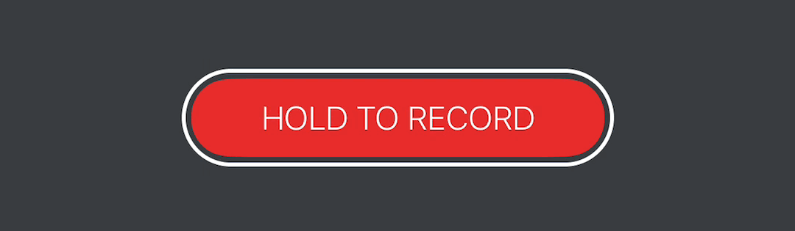

<p align="center">
    
</p>

<p align="center">
    <a href="https://travis-ci.org/BalestraPatrick/SquishyButton">
        
    </a>
    <a href="https://cocoapods.org/pods/SquishyButton">
        
    </a>
    <a href="https://github.com/Carthage/Carthage">
        
    </a>
    <a href="http://cocoapods.org/pods/SquishyButton">
        
    </a>
    <a href="http://cocoapods.org/pods/SquishyButton">
        
    </a>
    <a href="https://twitter.com/BalestraPatrick">
        
    </a>
</p>

Inspired by the new [Clips app](http://www.apple.com/lae/clips/) record button, `SquishyButton` is a `UIButton` subclass that implements the same design and behavior.

## Usage
Use it as every other `UIButton` object and customize it to suit your needs. These are the public properties that `SquishyButton` adds:

```swift
/// The number of pixels to scale the inner rectangle.
open var scaling = CGFloat(10)

/// The duration of the animation when the button is in the highlighted state.
open var animationDuration = 0.15

/// The color of the inner rectangle.
open var color = UIColor(red: 244.0/255.0, green: 51.0/255.0, blue: 50.0/255.0, alpha: 1.0)

/// The inset between the outer border and inner rectangle.
open var innerInset = CGFloat(5)
```

## Requirements
iOS 8.3 and Swift 3.1. 

## Installation

SquishyButton is available through [CocoaPods](http://cocoapods.org). To install
it, simply add the following line to your Podfile:

```ruby
pod 'SquishyButton'
```

You can also use [Carthage](https://github.com/Carthage/Carthage) if you prefer. Add this line to your `Cartfile`.

```ruby
github "BalestraPatrick/SquishyButton"
```

## Author

I'm [Patrick Balestra](http://www.patrickbalestra.com).
Email: [me@patrickbalestra.com](mailto:me@patrickbalestra.com)
Twitter: [@BalestraPatrick](http://twitter.com/BalestraPatrick).

## License

`SquishyButton` is available under the MIT license. See the [LICENSE](LICENSE) file for more info.
